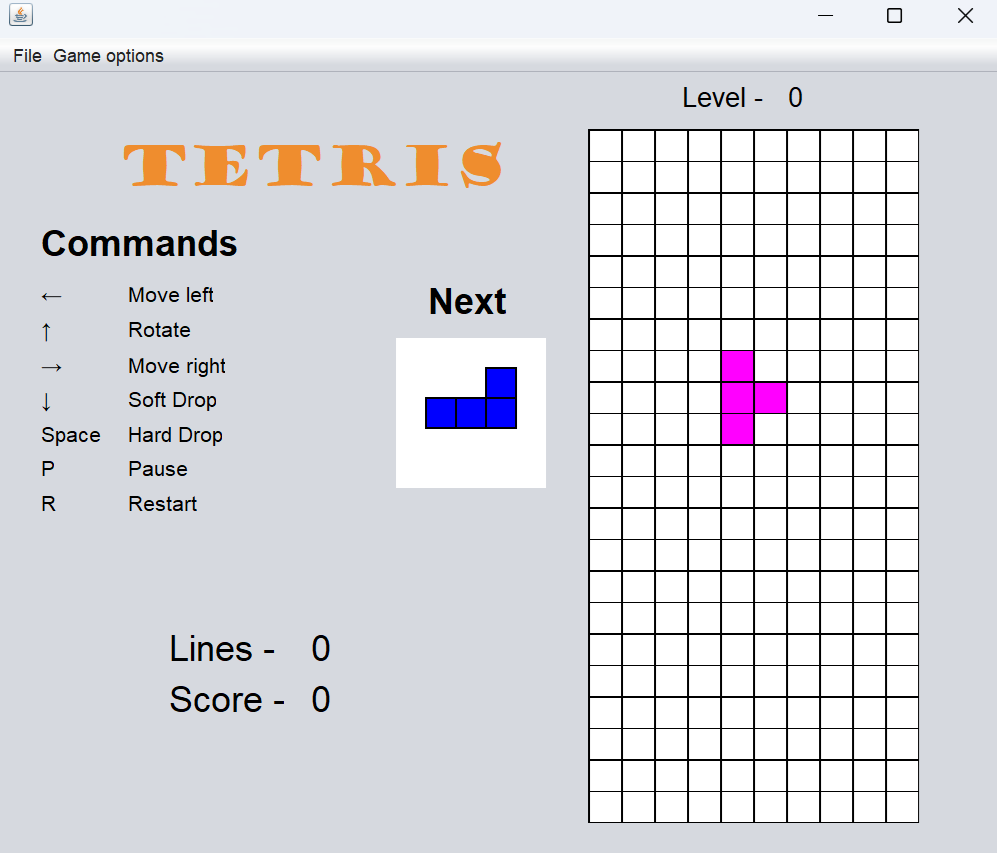

# Tetris Game

**Prerequisites**:
- Having Java Development Kit (JDK) installed on your machine

Follow the steps below to run the application from the command-line:
1. Compile the source code:
   ```
   javac -encoding UTF-8 -d bin path/to/your/file/src/main/java/org/tetris/*.java
   ```
2. Go to the bin folder:
   ```
   cd bin
   ```
3. Run the application
   ```
   java tetris.Tetris
   ```

You should get the following UI:



Enjoy your game!
